# ESCAPE FROM FELL MANOR

Escape From Fell Manor is a text-based adventure game run inside a terminal window. Users can play the game by typing responses into the window. It is a short but feature rich role-playing game which includes the use of character attributes, health points, equipment, items, and combat with various enemies. The game provides users with entertaining storylines, as well as challenges in the form of various puzzles and decision making.

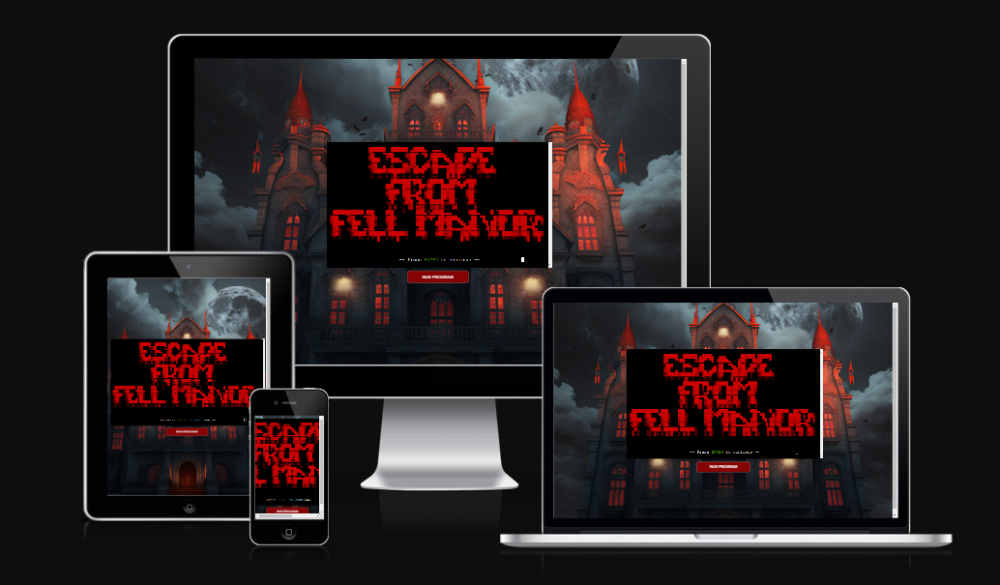


## UX

The UX is largely dictated by the constraints of running inside the terminal window, however, various colors were used to highlight an flavour certain text elements. When instructing the user to respond with a choice of words, those words are always highlighted in green. Text for health damage to the player and enemies is red. Item text is in cyan.

ASCII art was employed for the main game title and also to provide makeshift illustrations of certain game elements. The player map, for example uses a depiction of a scroll, as is described in game, to display the game map.

## Features

### Existing Features

- **Title Screen**

    - Title screen which loads first on running the programme. Title of the game is displayed in spooky ASCII art style and red in color.

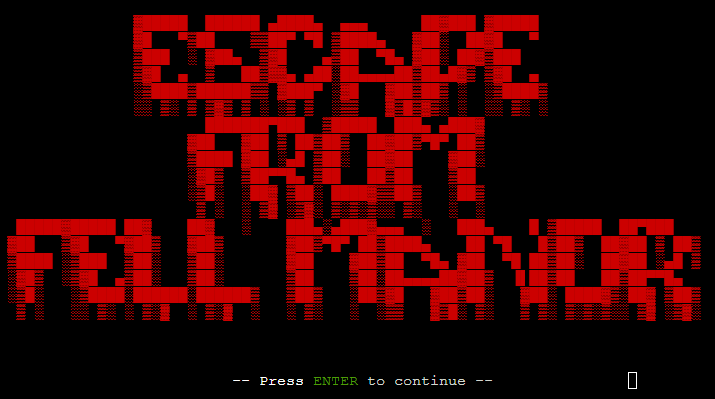

- **Main Menu**

    - Main menu for the player to navigate between game options. From this menu, users can begin the game, see help messages, quit the game, or see the hall of fame.

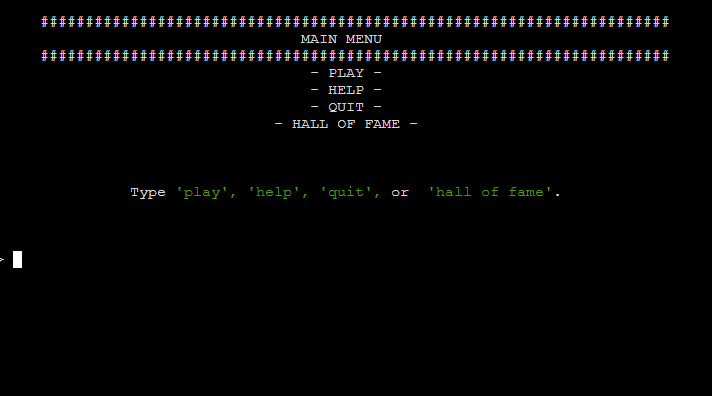

- **Help Messages**

    - Game instructions displayed when user types 'help' from the main menu. Short instructions keeps things simple for users. ASCII art used to display text on image of tattered banner

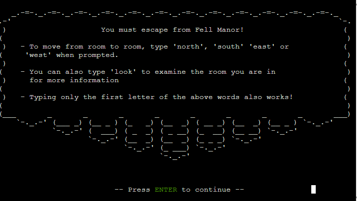

- **Hall of Fame**

    - Shows a formatted table of all players who have successfully completed the entire game. Shows players' names, their remaining health upon completing the game, and the date on which that they completed the game.

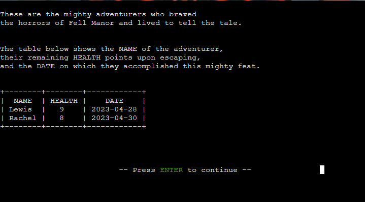

- **Type Effect on Game Text**

    - By default, the terminal prints all text in a block instantaneously. This feature prints letters one by one, to give the effect of the text being typed in real time. Different typing speeds are used to give the effect of slow or fast speech, for dramatic effect.

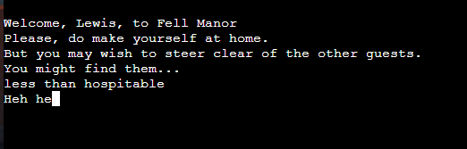

- **Player Name**

    - The game asks the player for their name upon starting the game, then uses that name throughout the game when referring to the player. The name is also used in the hall of fame, should the player successfully complete the game.

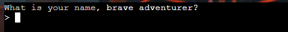

- **Main Game Prompt**

    - This prompt appears by default after every regular player action. It lists the actions that the player can take, including 'look', via which the player character will explore the room they are in, and possibly interact with room elements.

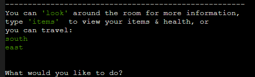

- **Navigation**

    - The player can navigate around the areas of the game by typing cardinal directions in response to game prompts. The available directions to the player are calculated automatically and displayed via the main game prompt.

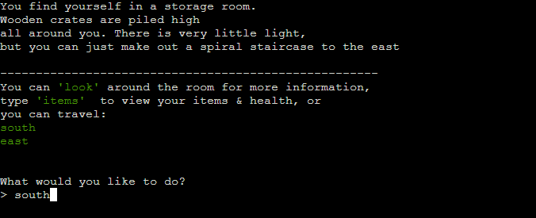

- **Items Screen**

    - This screen is displayed when a player types 'items' in response to the main prompt. The player is presented with a formatted and colour-coded list of the equipment and other items that they have found. This screen also lists the player's current health points.

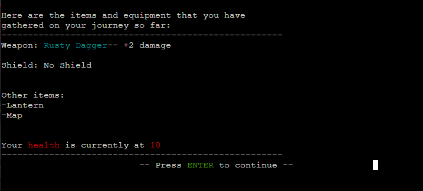

- **Player Health**

    - The game uses a health points system for both the player and enemy characters. Various traps and other game elements can either damage or restore the player's health by different amounts.

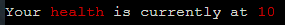

- **Combat**

    - Players can do battle with enemy characters via the game's combat system. The player's weapon determines their damage output and their armour determines their ability to mitigate damage. Enemies also have a damage output and armour rating which come into play during combat. Random number generation is used to create variance in combat numbers.

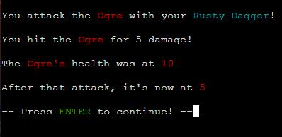

- **Weapons & Armour**

    - The player can find weapons and armour on their journey, which will improve their damage output in combat, and their damage mitigation in combat respectively. Weapons and armour are automatically equipped, unless a superior item is already in the player's possession. The player can view the item screen to see the exact damage and armour numbers that their equipment provides.

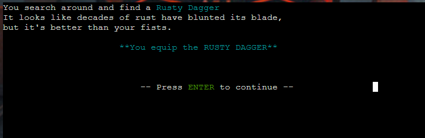

- **Shortened Prompt Responses**

    - Players can type both the full word, but also just the first letter of those words when prompted, providing the player with an easier way to interact with the game.

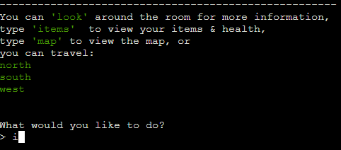

- **Special Prompts**

    - Certain game events cause special prompts to appear. These are different from the regular game prompt, to which the user can respond usually with a yes or no.

- **Player Death**

    - If the player's health ever drops to zero, the game displays the 'you died' message and the game ends, returning the user to the title screen.

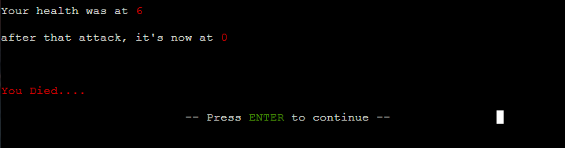

- **Game Map**

    - The player may find on their journey, a map. This will open up a new option in the main game prompt which will show the player a map of the game's rooms. The game detects which room the player is in an prints an 'X' on the map to denote the player's location. The map is displayed on ASCII art of a rolled-up scroll.

    Original code block for map reference:

```python
# Map ########
#     _________________
#     |a1 |a2 |a3 |a4 |
#     |___|___|___|___|
#     |b1 |b2 |b3 |b4 |
#     |___|___|___|___|
#     |c1 |c2 |c3 |c4 |
#     |___|___|___|___|
#     |d1 |d2 |d3 |d4 |
#     |___|___|___|___|
```
In game map ASCII art:

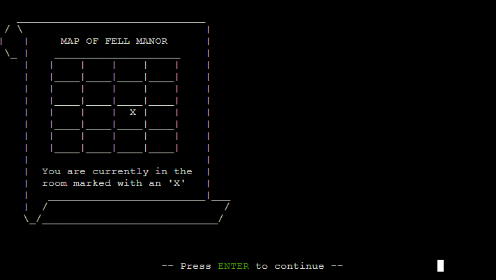

- **Re-entered Room Descriptions**

    - The game tracks whether a room has been visited previously by the player and if so, skips the slow typing effect and displays a shortened room description, to avoid the user having to wait while the same description is typed out.

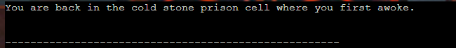

- **Colored character text**

    - Certain important enemies can speak to the player. When they do so, unique text colours are used to add flavour and to help the player to recognise these important enemies.

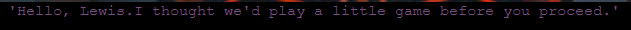

- **Name Validation**

    - The user's name is validated on input, checking whether it uses only alpha characters, and is between 2 and 15 characters in length. In the case of an invalid input, the prompt is then repeated to the user.

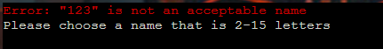

- **Main Input Validation**

    - When presented with the main game prompt, the user input is checked against all available choices at that current state. For example, if the player can only travel north, any other direction will flag as invalid. All other inputs that are not in the current available choices will also flag as invalid. The prompt is then repeated to the user.

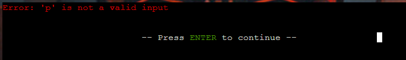

- **Yes/No Validation**

    - When presented with a special game prompt. The game validates the user's input based on the choices given in the prompt. If the game receives an invalid input from the user, the prompt is then repeated to the user.

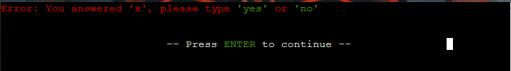

### Future Features

- Character customisation
    - Functionality to allow users to create different characters with different strengths & weaknesses. Possible character classes e.g. Warrior, Mage, Rogue etc.
- More equipment/item implementation
    - Inclusion of more weapons and armor with varying levels of power
- Scoring system
    - system to score player runs based on health/damage done/correct answers/time taken etc. Implemented into hall of fame to create ranked leaderboard.

## Tools & Technologies Used

- [Python](https://www.python.org) used for all functionality of site.
- [Git](https://git-scm.com) used for version control. (`git add`, `git commit`, `git push`)
- [GitHub](https://github.com) used for secure online code storage.
- [Gitpod](https://gitpod.io) used as a cloud-based IDE for development.
- [Heroku](https://www.heroku.com) used for hosting the deployed site.

## Data Model

### Flowchart

A flowchart was used to map out the 'rooms' of the game and to visualise the content of and connections between these 'rooms'. This was done using [Lucidchart](https://www.lucidchart.com/pages/ER-diagram-symbols-and-meaning)

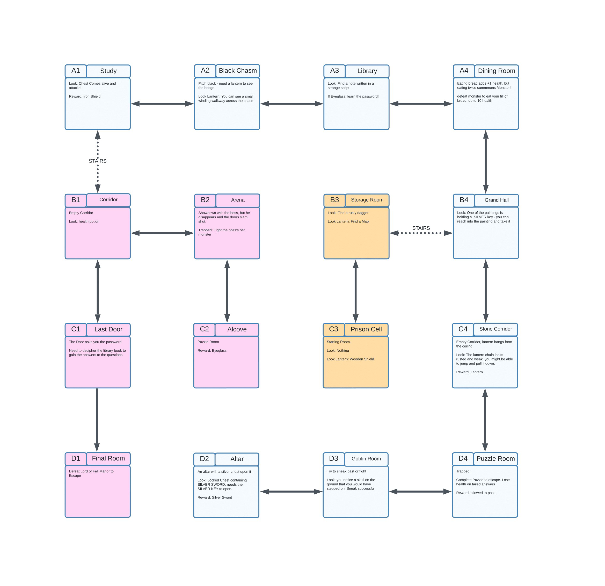

### Classes & Functions

The program uses classes as a blueprint for the project's objects (OOP). This allows for the object to be reusable.

```python
class Player:
    """
    Player character class
    """
    def __init__(
        self, name, location, health, weapon, strength, shield, armour,
        lantern, manormap, eyeglass, silver_key, password
                ):
        self.name = name
        self.location = location
        self.health = health
        self.weapon = weapon
        self.shield = shield
        self.strength = strength
        self.armour = armour
        self.lantern = lantern
        self.manormap = manormap
        self.eyeglass = eyeglass
        self.silver_key = silver_key
        self.password = password

myPlayer = Player(
    'Player', 'c3', 10, 'No Weapon', 2, 'No Shield', 2,
    False, False, False, False, False
    )
```
---
```python
class Monster:
    """
    Monster class
    """
    def __init__(self, name, health, strength, armour):
        self.name = name
        self.health = health
        self.strength = strength
        self.armour = armour

ogre = Monster('Ogre', 10, 4, 2)
goblin = Monster('Goblin', 8, 4, 1)
haunted_chest = Monster('Haunted Chest', 12, 5, 2)
gorehowl = Monster('Arena Beast', 18, 6, 1)
manor_lord = Monster('Lord of Fell Manor', 20, 7, 2)
```
---
```python
class Weapon:
    """
    Weapon class
    """
    def __init__(self, name, strength):
        self.name = name
        self.strength = strength

rusty_dagger = Weapon('RUSTY DAGGER', 4)
silver_sword = Weapon('SILVER SWORD', 8)
```
---
```python
class Shield:
    """
    Shield class
    """
    def __init__(self, name, armour):
        self.name = name
        self.armour = armour

wooden_shield = Shield('Wooden Shield', 4)
iron_shield = Shield('Iron Shield', 6)
```

The primary functions used on this application are:

- `main_prompt()`
    - Present available in-game actions to user.
- `print_room_descritpion()`
    - print the description of the room that the player is in.
- `print_room_details()`
    - prints the additional details of the room that the player is in. Runs after player uses the input 'look'. 
- `update_player_health()`
    - Increases or decreases the user character's health points.
- `update enemy health()`
    - Increases or decreases enemies' health points.
- `player_death()`
    - Runs if player health reaches zero. Displays 'You died' message and resets the game.
- `enemy_death()`
    - Runs if enemy health reaches zero. Displays victory message and runs next game functions.
- `calculate_valid_directions()`
    - Displays to the user a list of the cardinal directions currently available to travel in.
- `combat()`
    - Runs combat sequence between player and enemy. Loops until either is dead.
- `main()`
    - Runs initial program functions.

### Imports

I've used the following Python packages and/or external imported packages.

- `gspread`: used with the Google Sheets API
- `google.oauth2.service_account`: used for the Google Sheets API credentials
- `time`: used for adding time delays
- `sys`: used for text typing effect & quit game functions
- `os`: used for adding a `clear()` function
- `random`: used to get a random choice from a list
- `copy`: used to create deep copy of room dictionary from dictionary.py
- `datetime`: used to insert date into hall of fame entries
- `tabulate`: used to format hall of fame entries
- `colorama`: used for including color in the terminal

## Testing

For all testing, please refer to the [TESTING.md](TESTING.md) file.

## Deployment

Code Institute has provided a [template](https://github.com/Code-Institute-Org/python-essentials-template) to display the terminal view of this backend application in a modern web browser.
This is to improve the accessibility of the project to others.

The live deployed application can be found deployed on [Heroku](https://escape-from-fell-manor.herokuapp.com).

### Heroku Deployment

This project uses [Heroku](https://www.heroku.com), a platform as a service (PaaS) that enables developers to build, run, and operate applications entirely in the cloud.

Deployment steps are as follows, after account setup:

- Select **New** in the top-right corner of your Heroku Dashboard, and select **Create new app** from the dropdown menu.
- Your app name must be unique, and then choose a region closest to you (EU or USA), and finally, select **Create App**.
- From the new app **Settings**, click **Reveal Config Vars**, and set the value of KEY to `PORT`, and the value to `8000` then select *add*.
- If using any confidential credentials, such as CREDS.JSON, then these should be pasted in the Config Variables as well.
- Further down, to support dependencies, select **Add Buildpack**.
- The order of the buildpacks is important, select `Python` first, then `Node.js` second. (if they are not in this order, you can drag them to rearrange them)

Heroku needs two additional files in order to deploy properly.
- requirements.txt
- Procfile

You can install this project's **requirements** (where applicable) using:
- `pip3 install -r requirements.txt`

If you have your own packages that have been installed, then the requirements file needs updated using:
- `pip3 freeze --local > requirements.txt`

The **Procfile** can be created with the following command:
- `echo web: node index.js > Procfile`

For Heroku deployment, follow these steps to connect your own GitHub repository to the newly created app:

Either:
- Select **Automatic Deployment** from the Heroku app.

Or:
- In the Terminal/CLI, connect to Heroku using this command: `heroku login -i`
- Set the remote for Heroku: `heroku git:remote -a app_name` (replace *app_name* with your app name)
- After performing the standard Git `add`, `commit`, and `push` to GitHub, you can now type:
    - `git push heroku main`

The frontend terminal should now be connected and deployed to Heroku!

### Local Deployment

This project can be cloned or forked in order to make a local copy on your own system.

For either method, you will need to install any applicable packages found within the *requirements.txt* file.
- `pip3 install -r requirements.txt`.

If using any confidential credentials, such as `CREDS.json` or `env.py` data, these will need to be manually added to your own newly created project as well.

#### Cloning

You can clone the repository by following these steps:

1. Go to the [GitHub repository](https://github.com/LewisMDillon/escape-from-fell-manor) 
2. Locate the Code button above the list of files and click it 
3. Select if you prefer to clone using HTTPS, SSH, or GitHub CLI and click the copy button to copy the URL to your clipboard
4. Open Git Bash or Terminal
5. Change the current working directory to the one where you want the cloned directory
6. In your IDE Terminal, type the following command to clone my repository:
    - `git clone https://github.com/LewisMDillon/escape-from-fell-manor.git`
7. Press Enter to create your local clone.

Alternatively, if using Gitpod, you can click below to create your own workspace using this repository.

[](https://gitpod.io/#https://github.com/LewisMDillon/escape-from-fell-manor)

Please note that in order to directly open the project in Gitpod, you need to have the browser extension installed.
A tutorial on how to do that can be found [here](https://www.gitpod.io/docs/configure/user-settings/browser-extension).

#### Forking

By forking the GitHub Repository, we make a copy of the original repository on our GitHub account to view and/or make changes without affecting the original owner's repository.
You can fork this repository by using the following steps:

1. Log in to GitHub and locate the [GitHub Repository](https://github.com/LewisMDillon/escape-from-fell-manor)
2. At the top of the Repository (not top of page) just above the "Settings" Button on the menu, locate the "Fork" Button.
3. Once clicked, you should now have a copy of the original repository in your own GitHub account!

## Credits

### Content

| Source | Location | Notes |
| --- | --- | --- |
| [Markdown Builder](https://traveltimn.github.io/markdown-builder) | README and TESTING | tool to help generate the Markdown files |
| [StackOverflow](https://stackoverflow.com/questions/71163139/for-looping-over-dictionary-object) | dictionary | How to iterate over a dictionary with a loop |
| [StackOverflow](https://stackoverflow.com/questions/5598181/how-can-i-print-multiple-things-on-the-same-line-one-at-a-time) | color_type function | How to put separate print statements on one line |
| [YouTube](https://www.youtube.com/watch?v=MFW8DJ6qsak) | entire site | tutorial for making text-based game in python |
| [strftime](https://strftime.org) | Hall of Fame entries | helpful tool to format date/time from string |
| [101computing](https://www.101computing.net/python-typing-text-effect/) | entire site | tutorial for creating type effect in python terminal window applications |

### Media

| Source | Location | Type | Notes |
| --- | --- | --- | --- |
| [Tumblr](https://64.media.tumblr.com/e87832ae4f38697b1512a962bf46d78a/b12dd6256ec6ff0f-00/s1280x1920/eb208b169e38ddb3b4418f79ffa64868722e3d20.png) | Background image | image | background image behind terminal window |
| [Patorjk](https://patorjk.com/software/taag/#p=display&f=Graffiti&t=Type%20Something%20) | Title screen | ASCII text art | ASCII text art for main title |
| [ASCII Art.eu](https://www.asciiart.eu/) | help menu & game map | ASCII art | ASCII art used for help menu banner effect & game map parchment scroll effect |

### Acknowledgements

- I would like to thank my Code Institute mentor, [Tim Nelson](https://github.com/TravelTimN) for their support throughout the development of this project.
- I would like to thank the [Code Institute](https://codeinstitute.net) tutor team for their assistance with troubleshooting and debugging some project issues.
- I would like to thank the [Code Institute Slack community](https://code-institute-room.slack.com) for the moral support; it kept me going during periods of self doubt and imposter syndrome.
- I would like to thank my partner Rachel, for believing in me, and allowing me to make this transition into software development, and also for being the first player to complete the game and entering the Hall of Fame!


