# Testing

Return back to the [README.md](README.md) file.


## Code Validation


### Python

I have used the recommended [CI Python Linter](https://pep8ci.herokuapp.com) to validate all of my Python files.


| File | CI URL | Screenshot | Notes |
| --- | --- | --- | --- |
| run.py | [CI PEP8](https://pep8ci.herokuapp.com/https://raw.githubusercontent.com/LewisMDillon/escape-from-fell-manor/main/run.py) |  | Pass: No Errors |
| dictionary.py | [CI PEP8](https://pep8ci.herokuapp.com/https://raw.githubusercontent.com/LewisMDillon/escape-from-fell-manor/main/dictionary.py) |  | Pass: No Errors |
| gametext.py | [CI PEP8](https://pep8ci.herokuapp.com/https://raw.githubusercontent.com/LewisMDillon/escape-from-fell-manor/main/gametext.py) |  | Pass: No Errors |
| art.py | [CI PEP8](https://pep8ci.herokuapp.com/https://raw.githubusercontent.com/LewisMDillon/escape-from-fell-manor/main/art.py) |  | Pass: No Errors |

## Lighthouse Audit


I've tested my deployed project using the Lighthouse Audit tool to check for any major issues.

| Page | Size | Screenshot | Notes |
| --- | --- | --- | --- |
| Home | Mobile |  | Some minor warnings |
| Home | Desktop |  | Some minor warnings |


## Browser Compatibility

I've tested my deployed project on multiple browsers to check for compatibility issues.

| Browser | Screenshot | Notes |
| --- | --- | --- |
| Chrome | 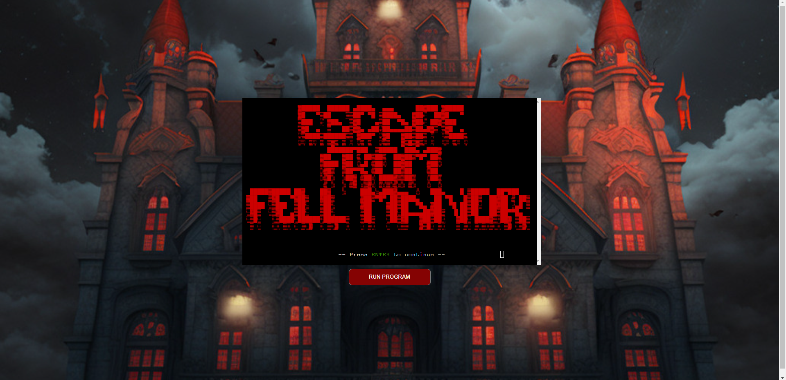 | Works as expected |
| Firefox |  | Works as expected |
| Edge | 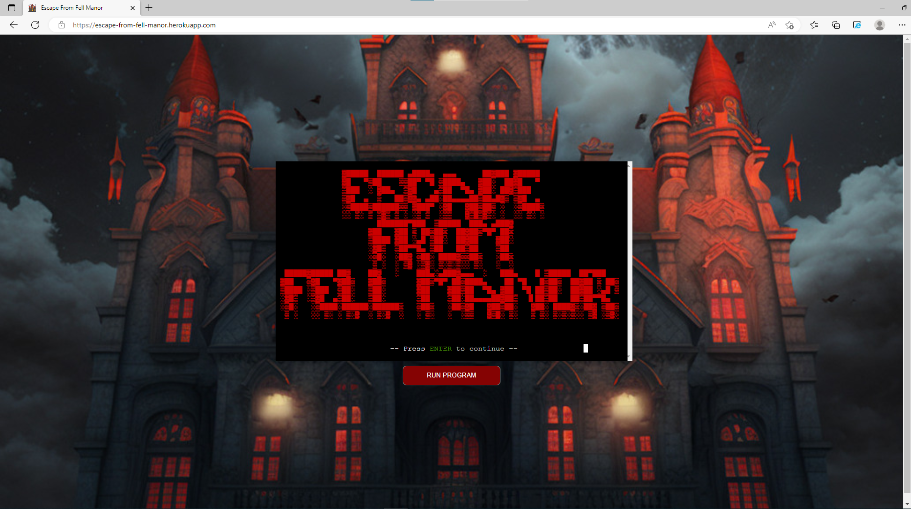 | Works as expected |
| Safari | 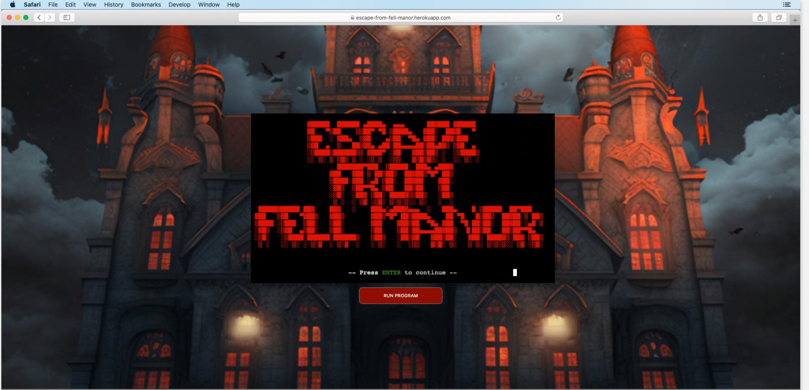 | Minor ASCII art differences |
| Brave | 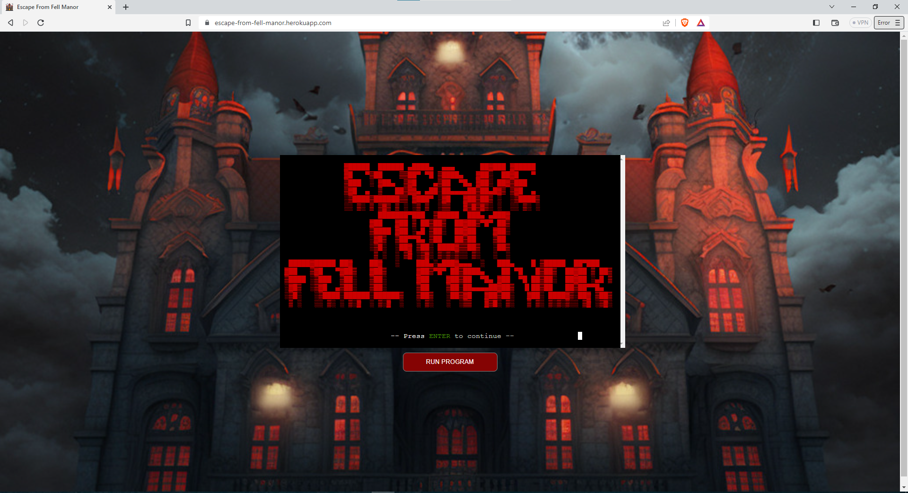 | Works as expected |
| Opera | 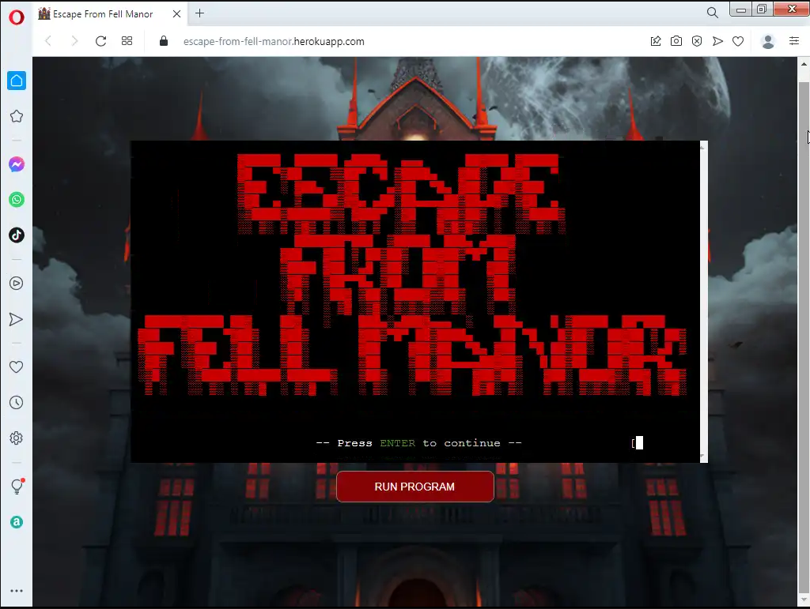 | Works as expected |
| Internet Explorer | 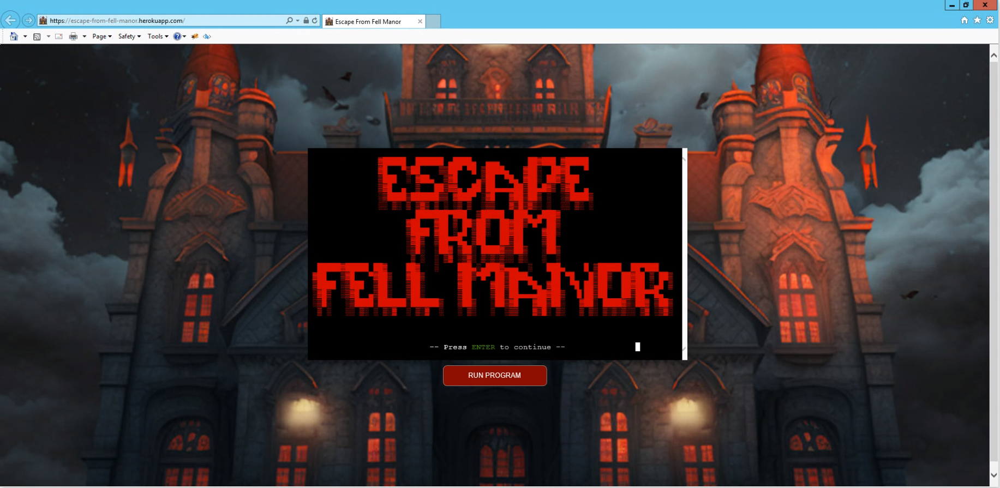 | Works as expected(!) |

## Responsiveness

I've tested my deployed project on multiple devices to check for responsiveness issues. Issues on smaller screen sizes are unfixable due to terminal provided by Code Institute.

| Device | Screenshot | Notes |
| --- | --- | --- |
| Mobile (DevTools) | 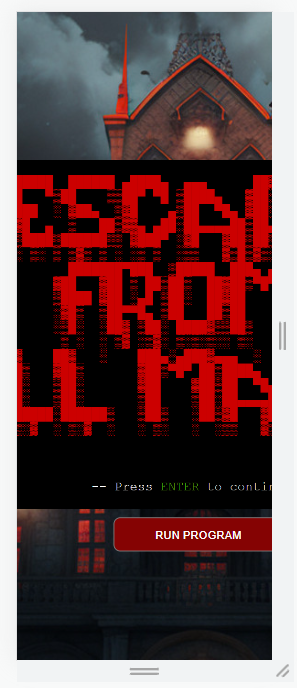 | Screen clipping issues |
| Tablet (DevTools) | 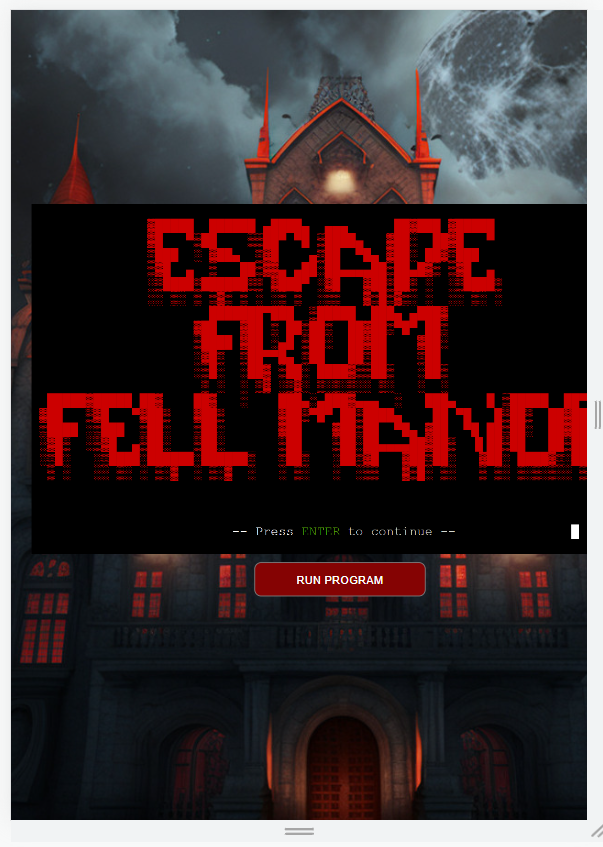 | Screen clipping issues |
| Desktop |  | Works as expected |
| XL Monitor | 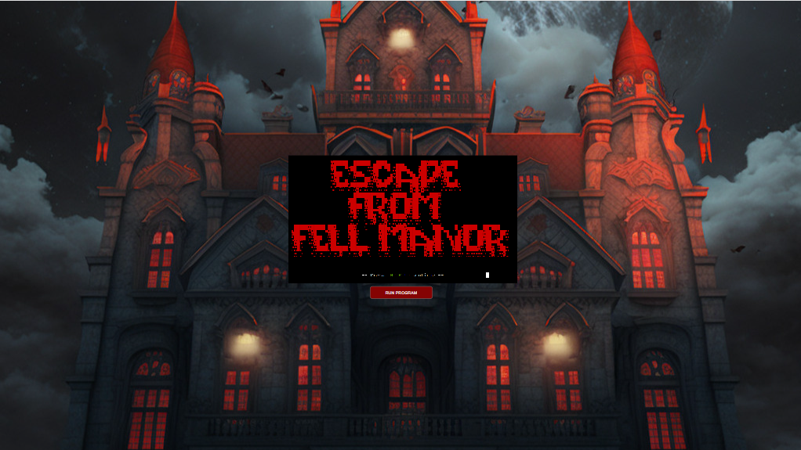 | Scaling starts to have minor issues |
| 4K Monitor | 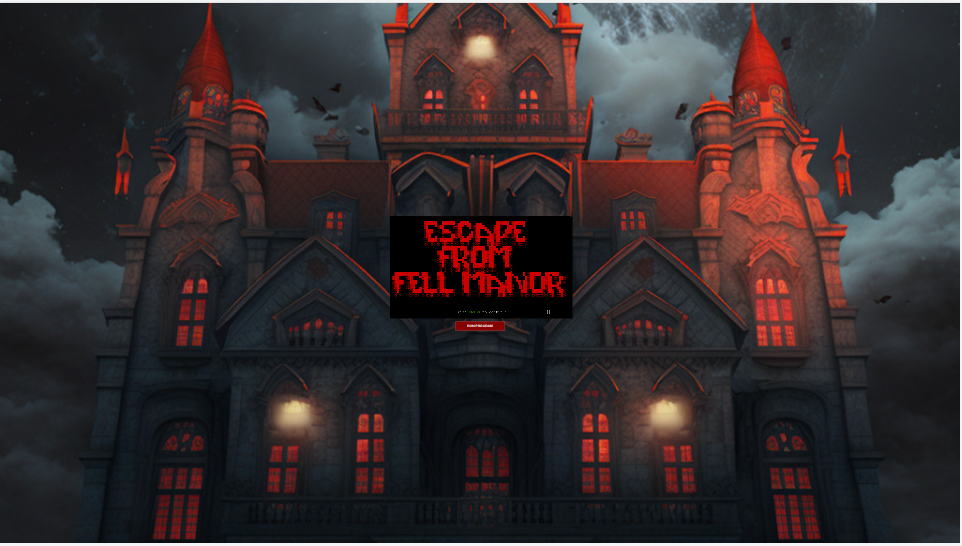 | Noticeable scaling issues |
| Oneplus Nord 2 | 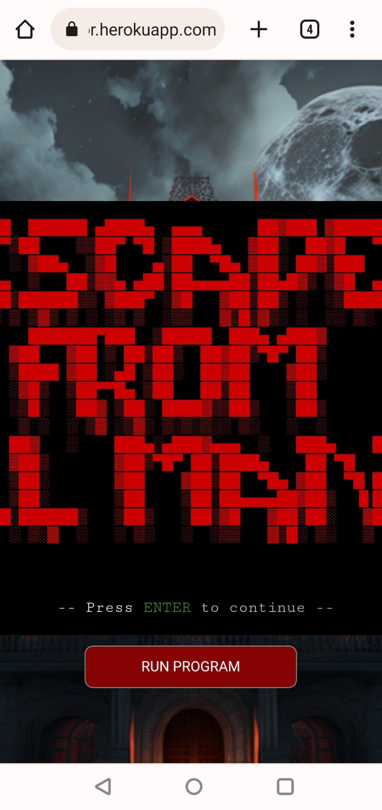 | Screen clipping issues |
| iPhone 13 | 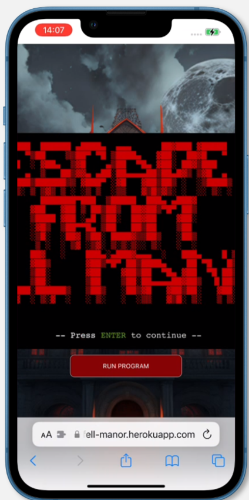 | Screen clipping issues |


## Defensive Programming


Defensive programming was manually tested with the below user acceptance testing:

| Page | User Action | Expected Result | Pass/Fail | Comments | Screenshot |
| --- | --- | --- | --- | --- | --- |
| Main Menu | | | | |
| | Input only from options given | Execute based on input | Pass | Input of any other text throws error an repeats prompt to user | 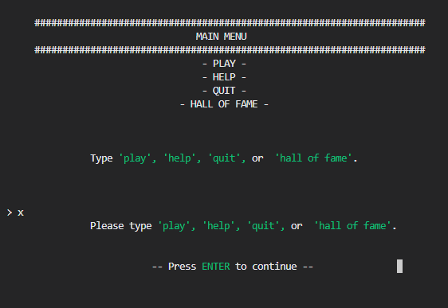 |
| User Name Request | | | | |
| | Input 2-15 alpha characters | Store name as player name | Pass | Input of any other kind e.g. numbers, special characters or whitespace throws error an repeats prompt to user | 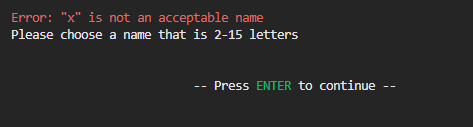 |
| Main Game Prompt | | | | |
| | Input only from options given | Execute based on input | Pass | Input of any other text throws error an repeats prompt to user | 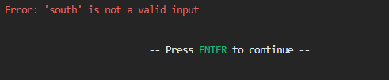 |
| Yes/No Prompts | | | | |
| | Input only 'yes' or 'no' | Execute based on input | Pass | Input of any other text throws error an repeats prompt to user. User is able to input any word beginning with 'y' for yes and 'n' for no |  |


## Bugs


- Enemy attacks not affecting player health

    

    - To fix this, I fixed a syntax error in the `update_player_health()` call.

- Player location not updating properly

    

    - To fix this, I fixed direction errors in the `room_map` dictionary.

- Player name not displaying properly

    

    - To fix this, I used an f string in the name prompt.

- Player equipment not updating

    

    - To fix this, I added a missing update to the Player class object inside the weapon find event.

- Game events not resetting to default state on soft reset of game.

    

    - To fix this, I created a new file, dictionary.py and moved the main room_map dictionary to that file. Then used a deep copy of that dictionary within run.py. This allowed the game to work with the temporary copy of the game rooms rather than altering the dictionary itself.

### GitHub **Issues**

**Fixed Bugs**

All previously closed/fixed bugs can be tracked [here](https://github.com/LewisMDillon/escape-from-fell-manor/issues?q=is%3Aissue+is%3Aclosed).

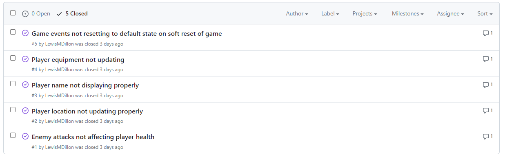


## Unfixed Bugs

- The user can type text into the terminal window when prompted to press ENTER

    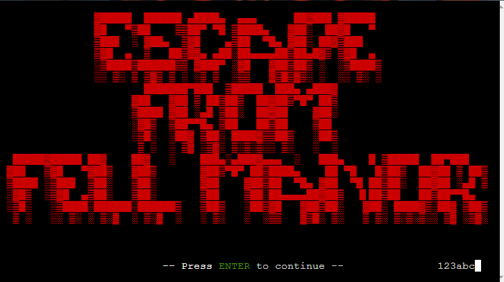

    - This is a limitation of the Code Institute terminal and unfixable by me.

- If the user presses CTRL + C, the program will quit and display a non user-friendly keyboard interrupt message.

    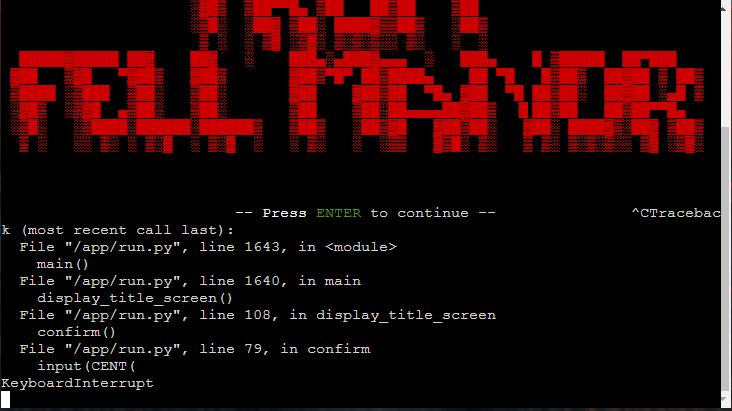

    - This is a limitation of th Code Institute terminal and unfixable by me.

There are no other remaining bugs that I am aware of.

## Code Refactoring

I refactored a 14 line if/else conditional check to a single, reusable print statement.

Original:

```python
    if color == 'red':
        print(f"{Fore.RED}{Style.NORMAL} ", end="", flush=True)
    elif color == 'green':
        print(f"{Fore.GREEN} ", end="", flush=True)
    elif color == 'yellow':
        print(f"{Fore.YELLOW} ", end="", flush=True)
    elif color == 'blue':
        print(f"{Fore.BLUE} ", end="", flush=True)
    elif color == 'magenta':
        print(f"{Fore.MAGENTA} ", end="", flush=True)
    elif color == 'cyan':
        print(f"{Fore.CYAN} ", end="", flush=True)
    elif color == 'white':
        print(f"{Fore.WHITE} ", end="", flush=True)
```

Reformatted to:

```python
print(f"{color}{Style.NORMAL} ", end="", flush=True)
```