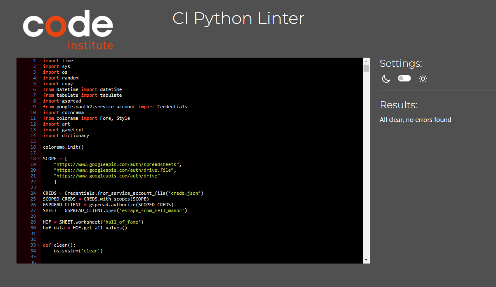
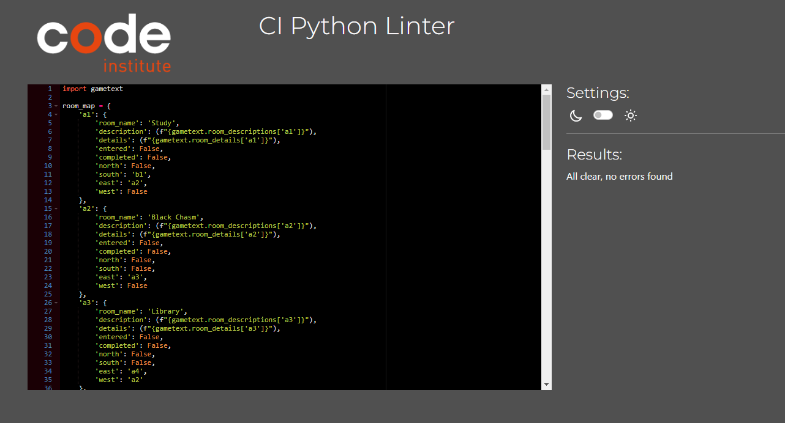
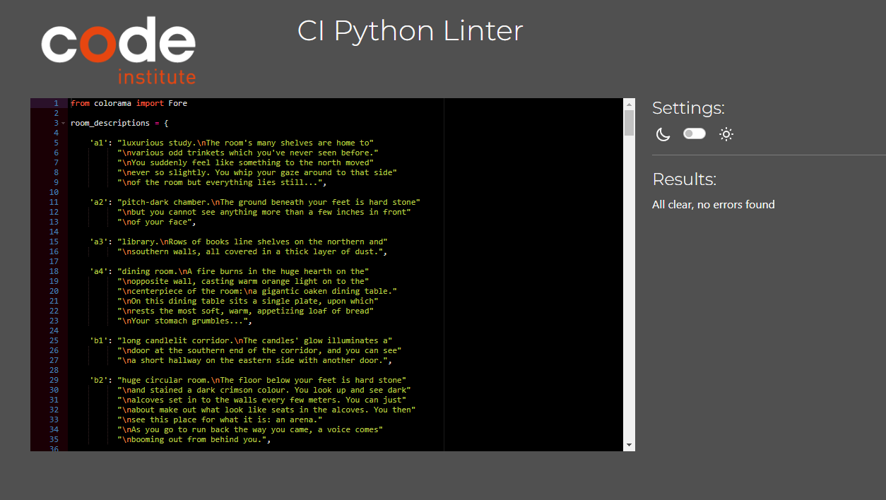
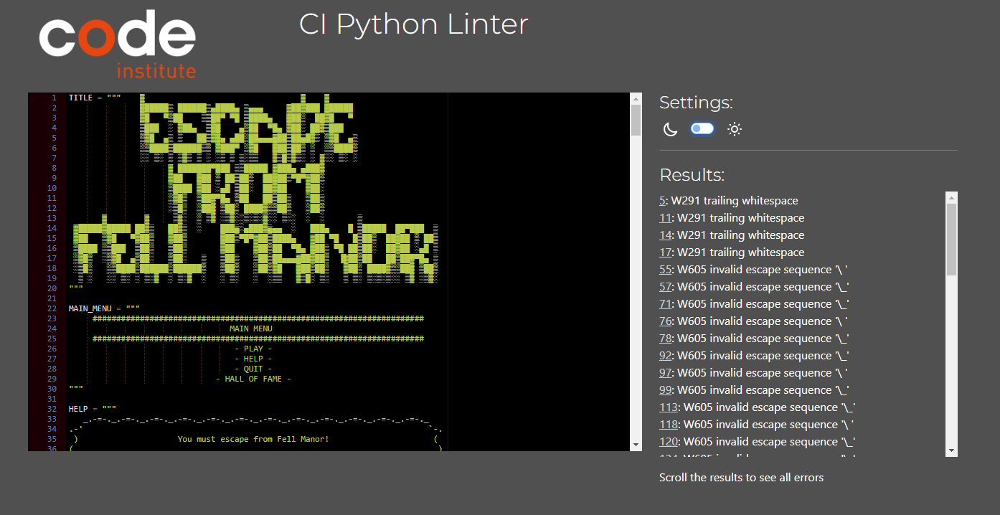

# Testing

Return back to the [README.md](README.md) file.

## Code Validation

### Python

I have used the recommended [CI Python Linter](https://pep8ci.herokuapp.com) to validate all of my Python files.

| File | CI URL | Screenshot | Notes |
| --- | --- | --- | --- |
| run.py | [CI PEP8](https://pep8ci.herokuapp.com/https://raw.githubusercontent.com/LewisMDillon/escape-from-fell-manor/main/run.py) |  | Pass: No Errors |
| dictionary.py | [CI PEP8](https://pep8ci.herokuapp.com/https://raw.githubusercontent.com/LewisMDillon/escape-from-fell-manor/main/dictionary.py) |  | Pass: No Errors |
| gametext.py | [CI PEP8](https://pep8ci.herokuapp.com/https://raw.githubusercontent.com/LewisMDillon/escape-from-fell-manor/main/gametext.py) |  | Pass: No Errors |
| art.py | [CI PEP8](https://pep8ci.herokuapp.com/https://raw.githubusercontent.com/LewisMDillon/escape-from-fell-manor/main/art.py) |  | Several Errors, expected as file contains ASCII art |

## Lighthouse Audit

I've tested my deployed project using the Lighthouse Audit tool to check for any major issues.

| Page | Size | Screenshot | Notes |
| --- | --- | --- | --- |
| Home | Mobile |  | Some minor warnings |
| Home | Desktop |  | Few warnings |

## Defensive Programming

Defensive programming was manually tested with the below user acceptance testing:

| Page | User Action | Expected Result | Pass/Fail | Comments |
| --- | --- | --- | --- | --- |
| Main Menu | | | | |
| | Input only from options given | Execute based on input | Pass | Input of of any other text throws error an repeats prompt to user |
| User Name Request | | | | |
| | Input 2-15 alpha characters | Store name as player name | Pass | Input of of any other kind eg. numbers, special characters or whitespace throws error an repeats prompt to user |
| Main Game Prompt | | | | |
| | Input only from options given | Execute based on input | Pass | Input of of any other text throws error an repeats prompt to user |
| Yes/No Prompts | | | | |
| | Input only 'yes' or 'no' | Execute based on input | Pass | Input of of any other text throws error an repeats prompt to user. User is able to input any word beginning with 'y' for yes and 'n' for no |

## Bugs

- Enemy attacks not affecting player health

    

    - To fix this, I fixed a syntax error in the update_player_health function call.

- Player location not updating properly

    

    - To fix this, I fixed direction errors in the room_map dictionary.

- Player name not displaying properly

    

    - To fix this, I used an f string in the name prompt.

- Player equipment not updating

    

    - To fix this, I added a missing update to the Player class object inside the weapon find event.

- Game events not resetting to default state on soft reset of game.

    

    - To fix this, I created a new file, dictionary.py and moved the main room_map dictionary to that file. Then used a deep copy of that dictionary within run.py. This allowed the game to work with the temporary copy of the game rooms rather than altering the dictionary itself.

### GitHub **Issues**

**Fixed Bugs**

All previously closed/fixed bugs can be tracked [here](https://github.com/LewisMDillon/escape-from-fell-manor/issues?q=is%3Aissue+is%3Aclosed).

## Unfixed Bugs

There are no remaining bugs that I am aware of.
